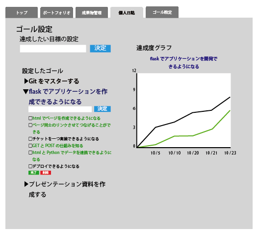
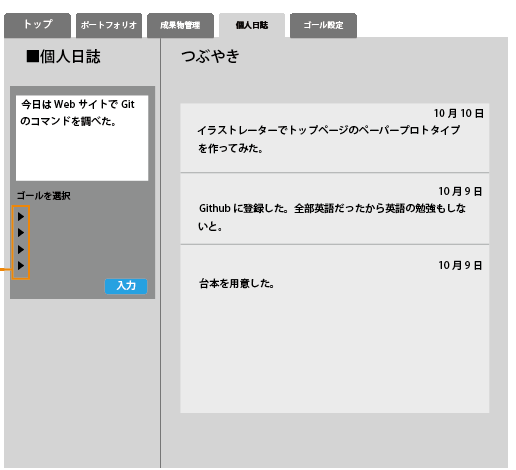
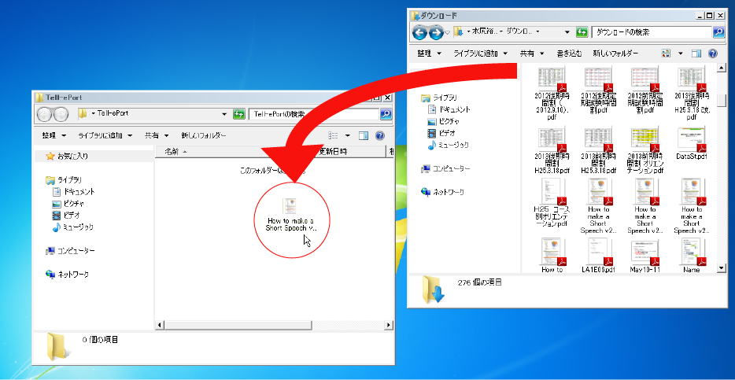
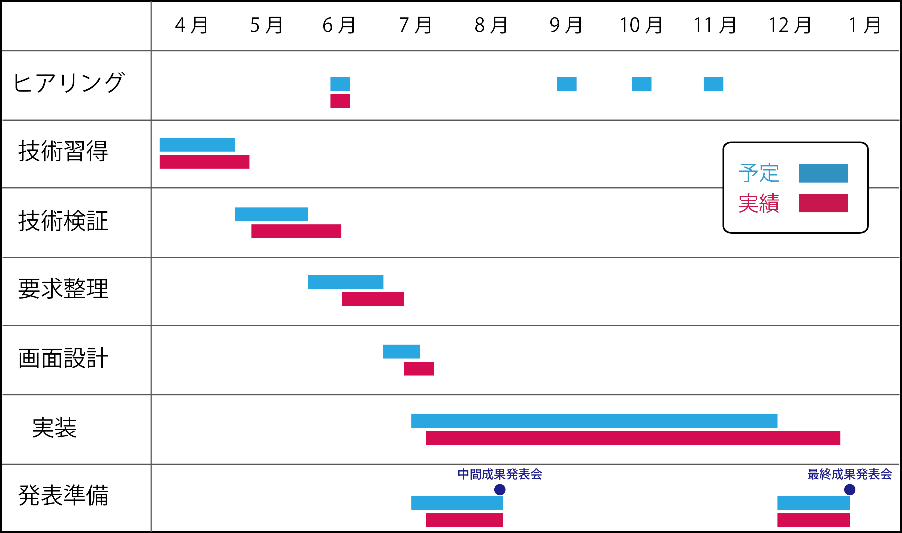

{
    "document-title": "後期最終成果発表会",
    "footer-text": "2014/1/24　後期最終成果発表会", 
    "aspect-ratio": 1.33,
    "show-footer-in-title-page": false
}

!SLIDE

## 高度ICT演習向け eポートフォリオシステムの開発 

<table id="meibo">
<tr>
<td width=35%>B4</td>
<td width=35%>B3</td>
<td width=35%>B2</td>
</tr>
<tr>
<td>中野 佑</td>
<td>赤木 勇極</td>
<td>内山 武尊</td>
</tr>
<tr>
<td>長崎 洸祐</td>
<td>菅野 久樹</td>
<td>川口 拓郎</td>
</tr>
<tr>
<td>山本 賢人</td>
<td>佐藤 祐磨</td>
<td>諸原 聖</td>
</tr>
<tr>
<td>&nbsp;</td>
<td>中田 友貴</td>
<td>水尻 裕人</td>
</tr>
<tr>
<td>&nbsp;</td>
<td>&nbsp;</td>
<td>&nbsp;</td>
</tr>
<tr>
<td>&nbsp;</td>
<td>&nbsp;</td>
<td>教員</td>
</tr>
<tr>
<td>&nbsp;</td>
<td>&nbsp;</td>
<td>神谷 年洋</td>
</tr>
</table>

!SLIDE
## 目次

- 高度ICT演習について
- 未来大のPBLにおける問題
- 一般的なeポートフォリオシステム
- 前期の活動
 - 要件収集
 - ヒアリング
 - ペーパープロトタイプ
 - 機能の洗い出し

- 後期の活動
 - 実装範囲の設定
 - 開発体制
- スケジュール
- 学び

!SLIDE
## 背景(1/2)

- 公立はこだて未来大学(以下、未来大)にはPBL\*型の授業として高度ICT演習がある
 - 単位が出ない中、学生が自主的に 活動を行う
 - ソフトウェア開発のプロセスを経験し、基礎となる知識やスキルを習得する
  

\*PBL: Project/Problem Based Learningの略。問題定義から解決までを学習者が主体的に学習を進めていく方法。

!SLIDE
## 背景(2/2)

### 受動的な学習(例: 座学)
* 座学の授業で教師による 一方的な知識伝達
* テストによる評価が行われる

### 能動的な学習(例: PBL)
* 学習者が自主的に問題設定し、 活動する
* 活動過程を含めた評価が必要

!SLIDE

## 問題
<ul>

<li>未来大の高度ICT演習には能動的な学習を支援するシステムが無い
<ul>
<li class="li-rightarrow">活動記録がないので見返す事ができない</li>
<li class="li-rightarrow">学生がどのように学習しているかわからない</li>
</ul>
</li>
<li>教員は学生に合わせた指導ができない
<ul>
<li class="li-rightarrow">学生ごとに活動が異なるため</li>
</ul>
</li>
</ul>
<ul>
<li>受動的な学習の中で、未来大ではMoodle\*を導入している</li></ul>
  

\*Moodle: CMS(Course Management System)の一種

!SLIDE

## 目的
- 高度ICT演習における
  - 学生の学習の振り返り及び担当教員の指導を支援する
  - 担当教員と学生からeポートフォリオシステムの要件を収集し、 取り入れながら開発をする
<!-- -->
<!-- - プロジェクトの進め方や最新技術に触れながら開発に関する知識を修得する(教育系PBLの目的) -->
<!-- -->

!SLIDE

## 一般的なeポートフォリオシステム
<ul>
	<li>システムを用い学習目標を立てることができる</li>
	<li>大学ごとにeポートフォリオシステムを構築しなければならない</li>
	<li>金沢工業大学では全体に導入している例もある</li>
  <li>自由に利用できるように公開されているものとしてMahara, sakaiなどがある</li>
</ul>
  

eポートフォリオ: 活動過程を人に見せるために、活動の証拠となるものや生成した成果物を載せたもの

!SLIDE
<!-- ## 紙のポートフォリオと比較して -->
<!-- * ネットワークを介したフィードバックや共同編集が可能 -->
<!-- * データが経年劣化しない -->
<!-- * 大量のデータを一つのPCで管理できる -->
<!--  -->
<!--  -->
<!--  
http://www.flickr.com/photos/lfr/2418668807/
 -->

## 既存のeポートフォリオ 
- 既存のeポートフォリオシステムを比較した

 

引用文献:宮崎誠「eポートフォリオシステム評価 - Mahara vs Sakai OSP -」 (法政大学情報メディア教育研究センター研究報告 Vol.25 特別号 2011年) 
  
- 要求を引き出しながら適応的に開発する必要がある

<!--  -->
<!--  -->

!SLIDE

## 前期の活動
- 高度ICT演習の担当教員によるeポートフォリオ要求定義会議
- 第1回ヒアリング
- ペーパープロトタイプ1回目
- 第2回ヒアリング
- ペーパープロトタイプ2回目
- 機能の洗い出し

!SLIDE

## 第1回ヒアリング
- 高度ICT演習の担当教員にeポートフォリオシステムについてヒアリングを行った

  - 高度ICT演習向けの開発をして欲しい
  - PDCAサイクルを回せるようにして欲しい
  - 動くシステムを定期的に見せて欲しい

!SLIDE

## ペーパープロトタイプ１回目

!SLIDE

## 第2回ヒアリング
- ７月にICTコース長にヒアリング
  - 学生はどのように使うのか
  - 先生はどのように使うのか
  - どのような機能が必要か

!SLIDE

## ペーパープロトタイプ２回目
- 実装するシステムをメンバー間で共有するために画面設計を行った

!SLIDE

## 洗いだした機能一覧
- ゴール管理機能
- 日誌投稿機能
- 成果物管理機能
- eポートフォリオ作成機能
- フィードバック機能
- グループ管理機能

!SLIDE
## ゴール管理機能
- 学習者が学習目標をたてて、目標達成までの過程を可視化する機能
 - 長期的なゴールが入力できる
 - ゴールの達成度をグラフで表示する

 
 
<b>\*ゴールの数が増減した場合でも進捗状況が判断しやすい

!SLIDE
## 日誌投稿機能
- 日々の活動をから、新たな発見や学び、困ったことを投稿できる
 - 短い文章で、システムに蓄積できる
 - ゴールと日誌の関連付けがされる

 

!SLIDE
## 成果物管理機能
- 活動によって生成された成果物をシステムに蓄積する
 - システムへPDFやソースコードのアップロードなどが行える
 - Webdav機能<!--多分伝わらない-->で、ファイルソフトを使ってアップロードできる
   

!SLIDE
## eポートフォリオ作成機能
- 行ってきた活動を振り返り、ひとつの形式にまとめる機能
 - ゴール、日誌、成果物からそれぞれ載せることができる
 - エクスポートすることができる
 - 学外の人向けにeポートフォリオを作成することができる
 
  

!SLIDE
## フィードバック機能
- 教員が、学習者の学習状況を把握し、指導するのを支援する機能
 - 学習者が作成したeポートフォリオへコメントをする
 

!SLIDE

## PDCAサイクルと機能の対応

### Plan  
  
 ゴール管理機能

### Do
  

   日誌投稿機能
   
   成果物管理機能
  

### Check
  

   eポートフォリオ作成機能

### Action
  

   フィードバック機能
  

<!-- -->
<!-- ## システム全体図 -->
<!-- 
 -->
<!--  -->
<!-- 
 -->
<!--  -->

!SLIDE

## 後期の活動
- 実装範囲の設定
- 開発

<!-- - Gitによる分散開発 -->
<!-- - Issueを使ったチケット駆動開発 -->

- 運用
<!-- - サーバを用意し実環境での動作確認 -->

!SLIDE

## ゴール管理機能
- 以下の機能は実装済み
  - 長期的なゴールの入力
  - 短期的なゴールの入力
  - グラフ表示
  - ゴールの削除

!SLIDE

## 日誌投稿機能
- 日誌をゴールによって分類する機能は実装しなかった
- 他の人との連携ができないので、他人の日誌を閲覧する機能は実装しなかった
- 以下の機能は実装済み
  - 日誌の投稿
  - 短期的なゴールのとの結びつけ

!SLIDE

## 成果物管理機能
- owncloudとの連携ができていないため、手動でのアップロードのみ実装
- ドラッグ＆ドロップによるアップロードは実装しなかった

!SLIDE

## グループ管理機能
- グループに持たせる機能を決めることができず、グループ管理機能は実装しなかった

!SLIDE

## フィードバック機能
<ul>
<li>認証ができておらず他の人との連携ができなかった</li>
<ul>
<li class="li-rightarrow">このため、フィードバック機能は実装できなかった</li>
</ul>
</ul>

!SLIDE

## 開発体制

!SLIDE

## 全体のスケジュール

!SLIDE

## 学び
<ul>
<li>演習を通して自分の知らなかった技術を知ることができたので視野が広がった (B4・情報デザインコース)
<li>チケット駆動開発とGitの仕組みについて知れた (B2・情報システムコース)
<li>ソフトウェア開発の一連の流れを体験することができた (B2・情報システムコース)
<li>Gitを利用した分散開発の仕組みを知ることができた (B2・情報システムコース)
</ul>

!SLIDE

## まとめ
- 高度ICT演習について
- 未来大のPBLにおける問題
- 高度ICT演習の学習および指導を支援
- 前期の活動
 - 要件収集
 - 機能の洗い出し
 - ペーパープロトタイプ
- 後期の活動
 - 開発
<!-- 目次と同じ感じですω・ -->

