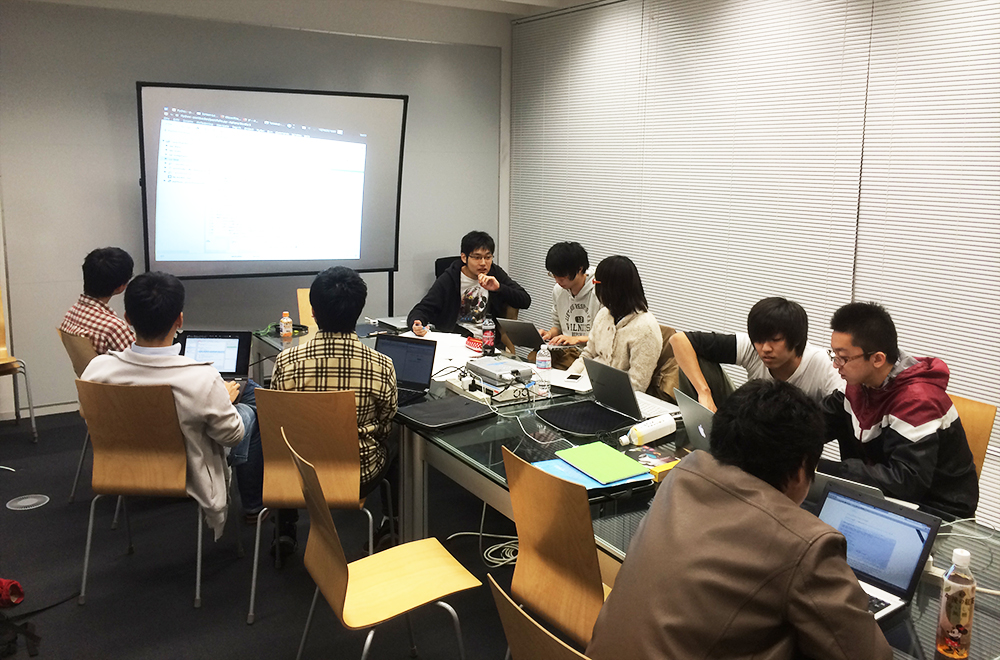
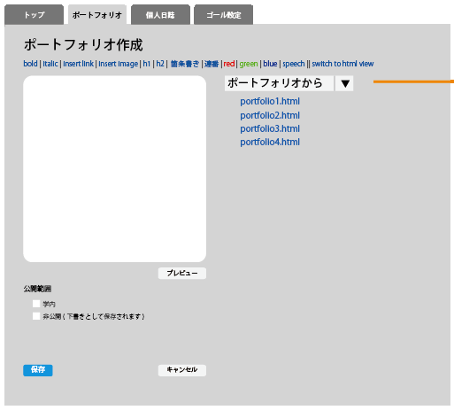

{
    "document-title": "後期最終成果発表会",
    "footer-text": "2014/1/24　後期最終成果発表会", 
    "aspect-ratio": 1.33,
    "show-footer-in-title-page": false
}

!SLIDE

## 高度ICT演習向け eポートフォリオシステムの開発 

<table id="meibo">
<tr>
<td width=35%>B4</td>
<td width=35%>B3</td>
<td width=35%>B2</td>
</tr>
<tr>
<td>中野 佑</td>
<td>赤木 勇極</td>
<td>内山 武尊</td>
</tr>
<tr>
<td>長崎 洸祐</td>
<td>菅野 久樹</td>
<td>川口 拓郎</td>
</tr>
<tr>
<td>山本 賢人</td>
<td>佐藤 祐磨</td>
<td>諸原 聖</td>
</tr>
<tr>
<td>&nbsp;</td>
<td>中田 友貴</td>
<td>水尻 裕人</td>
</tr>
<tr>
<td>&nbsp;</td>
<td>&nbsp;</td>
<td>&nbsp;</td>
</tr>
<tr>
<td>&nbsp;</td>
<td>&nbsp;</td>
<td>教員</td>
</tr>
<tr>
<td>&nbsp;</td>
<td>&nbsp;</td>
<td>神谷 年洋</td>
</tr>
</table>

!SLIDE
## 目次

- 授業の分類と本学の現状
- 本学のPBLにおける問題
- 一般的なeポートフォリオシステム
- 前期の活動
 - 要件収集
 - ヒアリング
 - ペーパープロトタイプ
 - 機能の洗い出し

- 後期の活動
 - 実装範囲の設定
 - 開発体制
- スケジュール
- 学び

!SLIDE
## 背景

 <b>受動的な学習(例: 座学)</b>

* 座学の授業で教師による 一方的な知識伝達
* 本学ではMoodle\*で支援 されている

 <b>能動的な学習(例: 高度ICT演習)</b>

* 学習者が自主的に問題設定し、 活動する
* 本学のPBLには学習を支援する システムが無い

\*Moodle: CMS(Course Management System)の一種

!SLIDE

## 問題
- 活動記録がないので見返すことができない
- 学生間で、どのように学習しているか共有できていない
- 学生ごとに活動が異なるため、教員は学生に合わせた指導ができない
 

&#11015;

 

これらの解決策としてeポートフォリオシステムを利用できる

!SLIDE

## eポートフォリオシステムとは
- 学習者個人に重きを置いた、学習活動を可視化する仕組み
- 授業に合わせて構築する必要がある
- 大学によっては全学的に導入している例もある
- 既存のeポートフォリオシステムとして、Mahara、sakaiなどがある
引用文献:小川賀代，小村道昭，大学力を高めるeポートフォリオ〜エビデンスに基づく教育の質保証を目指して〜，2012

!SLIDE

## 目的
- 高度ICT演習における
  - 学生の学習の振り返り及び担当教員の指導を支援する
  - 担当教員と学生からeポートフォリオシステムの要件を収集し、 取り入れながら開発をする
<!-- -->
<!-- - プロジェクトの進め方や最新技術に触れながら開発に関する知識を修得する(教育系PBLの目的) -->
<!-- -->

!SLIDE
## 教育系演習の概要
-要求開発
  - ヒアリング(2回)
  - 機能の洗い出し
  - プロトタイピング(2回)
- 実装
  - 開発範囲の設定
  - 使用技術の選定
- 開発体制

!SLIDE
## 調査
- 既存のeポートフォリオシステムを比較した

<!-- MaharaとSakaiの比較画像 -->
<table id="solid" width="100%" align="center" >
<tr>
	<th></th>
	<th>成果物の共有のしやすさ</th>
	<th>(教育光学的) 振り返り</th>
	<th>UI(操作性)</th>
	<th>eポートフォリオ公開のしやすさ</th>
	<th>カスタマイズ性</th>
</tr>
<tr align="center">
<td></td>
	<td>○</td>
	<td>○</td>
	<td>×</td>
	<td>×</td>
	<td>×</td>
</tr>
<tr align="center">
	<td></td>
	<td>○</td>
	<td>×</td>
	<td>○</td>
	<td>○</td>
	<td>×</td>
</tr>
</table>
 
引用文献:宮崎誠「eポートフォリオシステム評価 - Mahara vs Sakai OSP -」 (法政大学情報メディア教育研究センター研究報告 Vol.25 特別号 2011年) 
   
- 既存のeポートフォリオシステムは使用せずに開発を行う
  - 要求を引き出しながら適応的に開発する必要があるため

\*公開ポートフォリオ：

<!-- TODO公開→公開eポートフォリオ -->

!SLIDE

## 第1回ヒアリング
- 高度ICTコースのコース長へeポートフォリオシステムについて ヒアリングを行った
  - PDCAサイクルを回せるようにして欲しい
  - 動くシステムを定期的に見せて欲しい

!SLIDE

## プロトタイピング１回目
- ホワイトボードを使い、メンバー間で話し合いながら作成
- iPadで写真を取り、リンクをつけた

!SLIDE

## 第2回ヒアリング
- ７月にICTコース長にヒアリング
  - 学生はどのように使うのか
  - 先生はどのように使うのか
  - どのような機能が必要か

!SLIDE

## プロトタイピング２回目
- 実装するシステムをメンバー間で共有するために画面設計を行った

!SLIDE

## 洗い出された機能一覧
- ゴール管理機能
- 日誌投稿機能
- 成果物管理機能
- eポートフォリオ作成機能
- フィードバック機能
- グループ管理機能

!SLIDE

## PDCAサイクルと機能の対応

### Plan  
  
 ゴール管理機能

### Do
  

   日誌投稿機能
   
   成果物管理機能
  

### Check
  

   eポートフォリオ作成機能

### Action
  

   フィードバック機能
  

!SLIDE
## ゴール管理機能
- 学習者が学習目標をたてて、目標達成までの過程を可視化する機能
 - 長期的なゴールが入力できる
 - ゴールの達成度をバーンアップチャートで表示する

 
 
<b>\*ゴールの数が増減した場合でも進捗状況が判断しやすい

!SLIDE
## 日誌投稿機能
- 日々の活動をから、新たな発見や学び、困ったことを投稿できる
 - 短い文章で、システムに蓄積できる
 - ゴールと日誌の関連付けがされる

 

!SLIDE
## 成果物管理機能
- 活動によって生成された成果物をシステムに蓄積する
 - システムへPDFやソースコードのアップロードなどが行える
 - WebDAV機能で、ファイルソフトを使ってアップロードできる
   

!SLIDE
## eポートフォリオ作成機能
- 行ってきた活動を振り返り、ひとつの形式にまとめる機能
 - ゴール、日誌、成果物からそれぞれ載せることができる
 - エクスポートすることができる
 - 学外の人向けにeポートフォリオを作成することができる
 
  

!SLIDE
## フィードバック機能
- 教員が、学習者の学習状況を把握し、指導するのを支援する機能
 - 学習者が作成したeポートフォリオへコメントをする
 

<!-- -->
<!-- ## システム全体図 -->
<!-- 
 -->
<!--  -->
<!-- 
 -->
<!--  -->

!SLIDE
## 実装範囲の設定

- ゴール設定、日誌投稿、eポートフォリオ作成機能に力を入れて開発した
- 成果物管理機能は一部機能を限定して開発した
- フィードバック機能やグループ管理機能は実装範囲外とした

!SLIDE

## ゴール管理機能
<ul>
<li> 実装予定だった機能
<ul>
<li class="li-ballot-checked">長期的なゴールの入力</li> 
<li class="li-ballot-checked"> 短期的なゴールの入力</li>
<li class="li-ballot-checked"> グラフ表示</li>
<li class="li-ballot-checked"> ゴールの削除</li>
</ul>
</ul>

!SLIDE

## 日誌投稿機能

<ul>
<li> 実装予定だった機能
<ul>
<li class="li-ballot-checked">日誌の投稿</li> 
<li class="li-ballot-checked"> 短期的なゴールとの結びつけ</li>
<li class="li-ballot">日誌をゴールによって分類</li>
<li class="li-ballot"> 他人の日誌を閲覧</li>
</ul>
</ul>

!SLIDE

## 成果物管理機能
<ul>
<li> 実装予定だった機能
<ul>
<li class="li-ballot-checked">Webからのファイルアップロード</li> 
<li class="li-ballot">WebDAV機能によるアップロード</li>
</ul>
</ul>

!SLIDE

## eポートフォリオ作成機能
<ul>
<li> 実装予定だった機能
<ul>
<li class="li-ballot-checked">成果物管理のみ載せる</li> 
<li class="li-ballot">ゴール、日誌から載せる</li>
<li class="li-ballot">エクスポートができる</li>
<li class="li-ballot">学外向けに公開できる</li>
</ul>
</ul>

!SLIDE

## グループ管理機能
<ul>
<li class="li-ballot">グループ管理機能は実装しなかった
<ul>
<li>グループに持たせる役割を決めることができなかった</li>
</ul>
</li>
</ul>

 
## フィードバック機能
<ul>
<li class="li-ballot">フィードバック機能は実装できなかった
<ul>
<li>LDAP認証ができておらず他の人との連携ができなかった</li>
</ul>
</li>
</ul>

!SLIDE

## 開発体制

!SLIDE

## 全体のスケジュール

!SLIDE

## 学び
<ul>
<li>演習を通して自分の知らなかった技術を知ることができたので 視野が広がった (B4・情報デザインコース)
<li>チケット駆動開発とGitの仕組みについて知れた (B2・情報システムコース)
<li>ソフトウェア開発の一連の流れを体験することができた (B2・情報システムコース)
<li>ペーパープロトタイピングの手法などデザインの技術を 取り入れることができた (B4・情報システムコース)
</ul>

!SLIDE

## まとめ
- 受動的学習と能動的学習の説明
- 能動的学習の支援がされていない
- 高度ICT演習の学習および指導を支援
- eポートフォリオシステムを開発
<!--結論だけを書く-->
