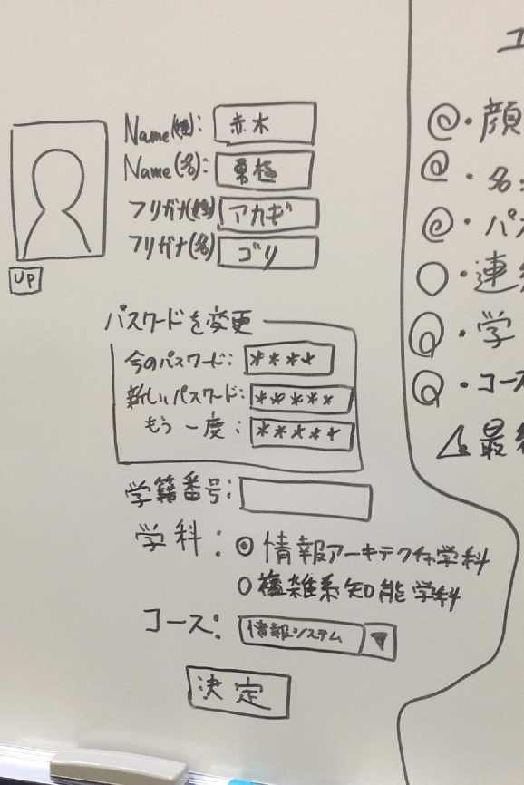
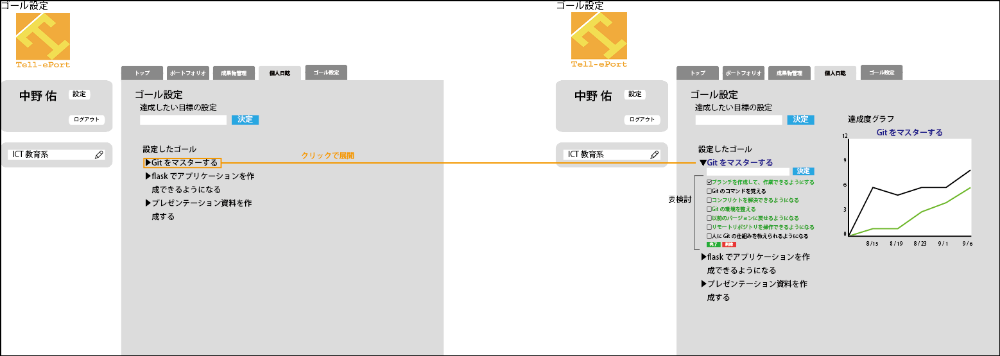

{
    "footer-text": "2014/1/24　後期最終成果発表会", 
    "show-footer-in-tiatle-page": false
}

!SLIDE

## 高度ICT演習向け eポートフォリオシステムの開発 

<table id="meibo">
<tr>
<td width=35%>B4</td>
<td width=35%>B3</td>
<td width=35%>B2</td>
</tr>
<tr>
<td>中野 佑</td>
<td>赤木 勇極</td>
<td>内山 武尊</td>
</tr>
<tr>
<td>長崎 洸祐</td>
<td>菅野 久樹</td>
<td>川口 拓郎</td>
</tr>
<tr>
<td>山本 賢人</td>
<td>佐藤 祐磨</td>
<td>諸原 聖</td>
</tr>
<tr>
<td>&nbsp;</td>
<td>中田 友貴</td>
<td>水尻 裕人</td>
</tr>
<tr>
<td>&nbsp;</td>
<td>&nbsp;</td>
<td>&nbsp;</td>
</tr>
<tr>
<td>&nbsp;</td>
<td>&nbsp;</td>
<td>教員</td>
</tr>
<tr>
<td>&nbsp;</td>
<td>&nbsp;</td>
<td>神谷 年洋</td>
</tr>
</table>

!SLIDE
## 目次
- 高度ICT演習について
- 未来大のPBLにおける問題
- 高度ICT演習の学習および指導を支援
- 前期の活動
 - 要件収集
 - 機能の洗い出し
 - ペーパープロトタイプ
- 後期の活動
 - 開発

!SLIDE
## 背景(1/2)

- 公立はこだて未来大学(以下、未来大)の特徴的な授業にPBLがありPBL型の授業として高度ICT演習がある
 - 単位が出ない中、学生が自主的に 活動を行う
 - ソフトウェア開発のプロセスを経験し、基礎となる知識やスキルを習得する

!SLIDE
## 背景(2/2)

### 受動的な学習(例: 座学)
* 座学の授業で教師による 一方的な知識伝達
* テストによる評価が行われる

### 能動的な学習(例: PBL*)
* 学習者が自主的に問題設定し、 活動する
* 活動過程を含めた評価が必要

<b>\*PBL: Project/Problem Based Learningの略。問題定義から解決までを学習者が主体的に学習を進めていく方法。
</b>

!SLIDE

## 問題
<ul>

<li>未来大の高度ICT演習には能動的な学習を支援するシステムが無い
<ul>
<li class="li-rightarrow">活動記録がないので見返す事ができない</li>
<li class="li-rightarrow">学生がどのように学習しているかわからない</li>
</ul>
</li>
<li>教員は学生に合わせた指導ができない。
<ul>
<li class="li-rightarrow">学生ごとに活動が異なるため</li>
</ul>
</li>
</ul>
<ul>
<li>受動的な学習の中で、未来大ではMoodle\*を導入している。</li></ul>
  

<b>\*Moodle: CMS(Course Management System)の一種
</b>

!SLIDE

## 目的
- 高度ICT演習における
  - 学生の学習の振り返り及び担当教員の指導を支援する
  - 担当教員と学生からeポートフォリオシステムの要件を収集し、 取り入れながら開発をする
<!--
- プロジェクトの進め方や最新技術に触れながら開発に関する知識を修得する(教育系PBLの目的)
 -->

!SLIDE

## 一般的なeポートフォリオシステム
<ul>
<li>eポートフォリオは学習者の学習活動の可視化が可能
</ul>
<ul>
<li>未来大で行われる能動的な学習には支援するシステムがない
<ul>
<li class="li-rightarrow">成果物が残らないので学生が後に振り返りが出来ない</li>
<li class="li-rightarrow">教員も学生の学習を確認が出来ないためアドバイスが出来ない</li>
</ul>
</li>
</ul>

!SLIDE
<!-- ## 紙のポートフォリオと比較して
* ネットワークを介したフィードバックや共同編集が可能
* データが経年劣化しない
* 大量のデータを一つのPCで管理できる

 
http://www.flickr.com/photos/lfr/2418668807/
 -->

## 既存のeポートフォリオ 
- 既存のeポートフォリオシステムを比較した

 

引用文献:宮崎誠「eポートフォリオシステム評価 - Mahara vs Sakai OSP -」 (法政大学情報メディア教育研究センター研究報告 Vol.25 特別号 2011年) 

- 要求を引き出しながら適応的に開発する必要がある

!SLIDE

## 前期の活動
- 高度ICT演習の担当教員によるeポートフォリオ要求定義会議
- ICTコース長にヒアリング
- ペーパープロトタイプの作成
- 再度ICTコース長にヒアリング
- 機能の洗い出し
- ヒアリング結果からペーパープロトタイプを再度作成
!SLIDE

## ヒアリング（5月末）
高度ICT演習の担当教員にeポートフォリオシステムについての会議を開いた

- 高度ICT演習向けの開発をして欲しい
- PDCAサイクルを回せるようにして欲しい
- 動くシステムを定期的に見せて欲しい

!SLIDE

## PDCAサイクル
### Plan  
   ゴール管理機能
### Do
   日誌投稿機能
   
   成果物管理機能
### Check
   eポートフォリオ作成機能
### Action
   フィードバック機能

!SLIDE

## システム全体図

!SLIDE

## ペーパープロトタイプ１回目

!SLIDE

## ペーパープロトタイプ２回目
- 実装するシステムをメンバー間で共有するために画面設計を行った

!SLIDE

## 後期の活動
- 開発
 - Gitによる分散開発
 - Issueを使ったチケット駆動開発
- 実装範囲の設定
- 運用
 - サーバを用意し実環境での動作確認
!SLIDE

## 開発体制

!SLIDE

## スコープ 1/2 
<table border>
<tr>
<td>機能</td>
<td>実装する</td>
</tr>

<tr>
<td>グループの管理ができる</td>
<td></td>
</tr>

<tr>
<td>外部からポートフォリオを閲覧する</td>
<td></td>
</tr>

<tr>
<td>教員が学生の学習成果物を閲覧できる</td>
<td></td>
</tr>

<tr>
<td>学生が教員からレビューをもらうことができる</td>
<td></td>
</tr>

<tr>
<td>教員が学生の目標を知ることができる</td>
<td align = "center">○</td>
</tr>

<tr>
<td>学生が学内公開と、学外公開用のビューを作成することができる</td>
<td align = "center">○</td>
</tr>

<tr>
<td>学生が学習成果物を管理することができる</td>
<td align = "center">○</td>
</tr>
<tr>

<tr>
<td>ゴールをグラフで可視化</td>
<td align = "center">○</td>
</tr>

</table>

!SLIDE

## スコープ 2/2

<table border>
<tr>
<td>機能</td>
<td>実装する</td>
</tr>

<tr>
<td>ローカルから成果物をアップロード</td>
<td></td>
</tr>

<tr>
<td>ゴールと日誌の関連付け</td>
<td align = "center">○</td>
</tr>

<tr>
<td>学生が目標と現状の自己評価をすることができる</td>
<td align = "center">○</td>
</tr>

<tr>
<td>ユーザの検索</td>
<td></td>
</tr>

<tr>
<td>認証</td>
<td></td>
</tr>

<tr>
<td></td>
<td></td>
</tr>

<tr>
<td></td>
<td></td>
</tr>

<tr>
<td></td>
<td></td>
</tr>

</table>

!SLIDE

## 全体のスケジュール

!SLIDE

## 学び
- 全体を通して(2年生とか)なにかあれば

!SLIDE

## まとめ
- 高度ICT演習について
- 未来大のPBLにおける問題
- 高度ICT演習の学習および指導を支援
- 前期の活動
 - 要件収集
 - 機能の洗い出し
 - ペーパープロトタイプ
- 後期の活動
 - 開発
<!-- 
目次と同じ感じですω・
-->

