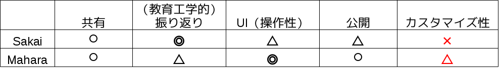

{
    "footer-text": "後期最終成果発表会",
    "show-footer-in-title-page": false
}

!SLIDE

## 高度ICT演習向け eポートフォリオシステムの開発 

<table id="meibo">
<tr>
<td width=35%>B4</td>
<td width=35%>B3</td>
<td width=35%>B2</td>
</tr>
<tr>
<td>中野 佑</td>
<td>赤木 勇極</td>
<td>内山 武尊</td>
</tr>
<tr>
<td>長崎 洸祐</td>
<td>菅野 久樹</td>
<td>川口 拓郎</td>
</tr>
<tr>
<td>山本 賢人</td>
<td>佐藤 祐磨</td>
<td>諸原 聖</td>
</tr>
<tr>
<td>&nbsp;</td>
<td>中田 友貴</td>
<td>水尻 裕人</td>
</tr>
<tr>
<td>&nbsp;</td>
<td>&nbsp;</td>
<td>&nbsp;</td>
</tr>
<tr>
<td>&nbsp;</td>
<td>&nbsp;</td>
<td>教員</td>
</tr>
<tr>
<td>&nbsp;</td>
<td>&nbsp;</td>
<td>神谷 年洋</td>
</tr>
</table>

!SLIDE
## 目次
- 

!SLIDE
## 背景(1/2)
- 公立はこだて未来大学の特徴的な授業にPBLがあり PBL型の授業として高度ICT演習がある
 - 単位が出ない中、学生が自主的に活動を行う
 - ソフトウェア開発のプロセスを経験し、基礎となる 知識やスキルを習得する

!SLIDE
## 背景(2/2)
- 受動的な学習(e.g. 座学)
 - 座学の授業で教師による一方的な知識伝達
 - テストによる評価が行われる
- 能動的な学習(e.g. ICT演習)
 - 学習者の自律性や自主性に重点を置く
 - 社会にある解のない複雑な問題に対応する 力を身につける

 

!SLIDE

## 問題
<ul>
<li>受動的な学習の中で、大学ではMoodle\*を導入している。</li>
<li>能動的な学習には支援するシステムが無い。
<ul>
<li class="li-rightarrow">活動記録がないので見返す事ができない。</li>
<li class="li-rightarrow">学生は後で振り返る事ができて、教員は学生の学習を確認したい。</li>
</ul>
</li>
<li>教員は学生に合わせた指導ができない。
<ul>
<li class="li-rightarrow">学生によって行う活動が異なる。</li>
</ul>
</li>
</ul>

 \*Moodle:Course Management Systemの一種

!SLIDE

## 目的
- 高度ICT演習における学生の学習の振り返り及び担当教員の指導を支援する
- 担当教員と学生からeポートフォリオシステムの要件を収集する

!SLIDE

## 一般的なeポートフォリオシステム
- eポートフォリオは学習者の学習活動の可視化が可能
- 能動的な学習には支援するシステムがない
 →学びを復習出来ないため学生が後に振り返りが出来ない。
 →教員も学生の学習を確認が出来ないためアドバイスが出来ない。

!SLIDE

## 紙のポートフォリオと比較して
* ネットワークを介したフィードバックや共同編集が可能
* データが経年劣化しない
* 大量のデータを一つのPCで管理できる

 
http://www.flickr.com/photos/lfr/2418668807/

!SLIDE

## 既存のeポートフォリオ 
- 既存のeポートフォリオシステムを比較した
 
引用文献:宮崎誠「eポートフォリオシステム評価 - Mahara vs Sakai OSP -」 (法政大学情報メディア教育研究センター研究報告 Vol.25 特別号 2011年)

 

http://www.flickr.com/photos/77018488@N03/8673758843/sizes/m/

!SLIDE

## 前期の活動
- ICT教員によるeポートフォリオ要求定義会議
- ペーパープロトタイプの作成(デモもしくは写真載せる)
- 大場先生にヒアリング
- ヒアリング結果からペーパープロトタイプをもう一度作成
!SLIDE

## ヒアリング（5月末）
ステークホルダーである高度ICT演習の担当教員に、 
eポートフォリオシステムについての会議を開いた

- 高度ICT演習向けの開発をして欲しい
- PDCAサイクルを回せるようにして欲しい
- 動くシステムを定期的に見せて欲しい

!SLIDE

##ペーパープロトタイプ
- ペーパープロトタイプ載せる予定

!SLIDE

## 後期の活動
- 開発・開発体制
	* UX・プログラム実装、サーバー・ownCloud
- システムのデモ

!SLIDE

## スコープ 1/2 
<table border>
<tr>
<td>要求</td>
<td>実装する</td>
</tr>
<tr>
<td>ユーザー管理ができる</td>
<td>○</td>
</tr>
<tr>
<td>外部からのビューを確認する</td>
<td>?</td>
</tr>
<tr>
<td>教員が学生の学習成果物を閲覧できる</td>
<td>○</td>
</tr>
<tr>
<td>学生が教員からレビューをもらうことができる</td>
<td>○</td>
</tr>
<tr>
<td>教員が学生の目標を知ることができる</td>
<td>○</td>
</tr>
<tr>
<td>学生が学内公開と、学外公開用のビューを作成することができる</td>
<td>○</td>
</tr>
<tr>
<td>学生が学習成果物を管理することができる
</td>
<td>○</td>
</tr>
<tr>
<td>グループ機能
</td>
<td>×</td>
</tr>
</table>

!SLIDE

## スコープ 2/2

<table>
<tr>
<td>学生が目標を変更することができる</td>
<td>○</td>
</tr>
<tr>
<td>学生が興味のあることを変更できる
</td>
<td>○</td>
</tr>
<tr>
<td>目標と学習成果物の関連付け</td>
<td>○</td>
</tr>
<tr>
<td>学生のエントリーシートを作る手助けになる</td>
<td>○</td>
</tr>
<tr>
<td>学生が目標と現状の自己評価をすることができる
</td>
<td>○</td>
</tr>
<tr>
<td>学外の人が学生の行なってきた活動を閲覧できる
</td>
<td>?</td>
</tr>
<tr>
<td>教員が学生の成績を見ることができる
</td>
<td>?</td>
</tr>
<tr>
<td>学生がタグで検索
</td>
<td>?</td>
</tr>
<tr>
<td>システムがFacebookと連携できる
</td>
<td>×</td>
</tr>
<tr>
<td>システムがRedmineと連携できる
</td>
<td>×</td>
</tr>
</table>

!SLIDE

## 全体のスケジュール

!SLIDE

## 学び
- 全体を通して(2年生とか)なにかあれば

!SLIDE

## まとめ
- スライドの流れを載せる

